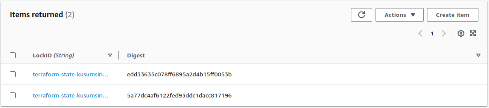

# Continuous Deployment to Kubernetes with GitHub Actions
## Introduction

This repository uses the GitHub [CI/CD pipeline](https://resources.github.com/ci-cd/) to deploy applications on a Kubernetes cluster. 

Instead of manually deploying the application via `kubectl` commands or `terraform` commands, the process can be automated with a CI/CD pipeline.
The Terraform backend uses S3 and DynamoDB with state locking.

## Workflow
The [main.yml](.github/workflows/main.yml) file handles the CD process. Its 'deploy' task contains several steps as follows.

1. `aws-actions/configure-aws-credentials@v1` This provides AWS credentials for virtual environments hosted on GitHub (Runners).

2. `tale/kubectl-action@v1` GitHub Action to manage a K8s cluster using kubectl
3. `actions/checkout@v2` Checkout the code from Git repository
4. `hashicorp/setup-terraform@v2` sets up Terraform CLI in workflow
5. `Terraform Init` initializes working directory
6. `Terraform Validate` validate the configuration internally
7. `Terraform Plan` creates the execution plan
8. `Terraform Apply` executes the actions

## Locking the Terraform state file
By default, Terraform stores state locally in `terraform.tfstate` file. When working with Terraform in a team, use of a local file makes Terraform usage complicated because each user must make sure they always have the latest state data before running Terraform and make sure that nobody else runs Terraform at the same time.

With remote state, Terraform writes the state data to a remote data store (In this case S3), which can then be shared between all members of a team.
With support of DynamoDB, Terraform will lock state for all operations. This prevents others from acquiring the lock and potentially corrupting state.

